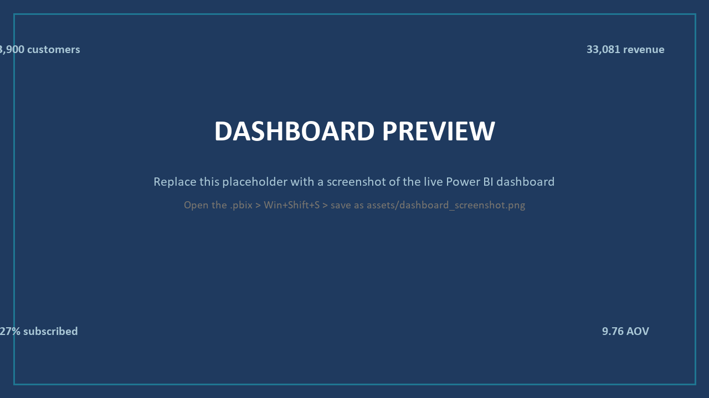

# Customer Shopping Behavior Analysis

**End-to-end retail analytics: Python → PostgreSQL → Power BI → report & presentation.**
What 3,900 purchases reveal about revenue, discounts, subscriptions, and loyalty — with verified numbers and prioritized recommendations.

---

## Live Dashboard

<!-- After publishing to Power BI Service: replace the placeholder below with a screenshot in assets/ and add your Publish-to-web link -->

*Interactive dashboard: KPI cards, subscription share, revenue & sales by category and age group, with slicers for gender, category, subscription status, and shipping type.*
<!-- Link: [View the interactive dashboard](https://app.powerbi.com/...) -->

## Business Problem

A retail company wants to understand its customers' shopping behavior to improve sales, satisfaction, and loyalty. The overarching question:

> *How can the company leverage consumer shopping data to identify trends, improve customer engagement, and optimize marketing and product strategies?*

The analysis answers **10 business questions** covering revenue by gender and age group, discount behavior, subscriber economics, shipping preferences, product ratings, and loyalty segmentation.

## Key Findings

| # | Finding | The numbers |
|---|---------|-------------|
| 1 | **Clothing drives nearly half of revenue** | $104,264 of $233,081 total (44.7%); Outerwear last at $18,524 (7.9%) |
| 2 | **The gender revenue gap is audience size, not spending** | Male $157,890 (67.7%) vs Female $75,191 — but per-customer spend is near-identical ($59.54 vs $60.25) |
| 3 | **No age cohort is weak** | Revenue spread across four age quartiles (18–70) is only 11%; Young Adults lead at $62,143 |
| 4 | **Subscribers don't spend more per order** | $59.49 (subscribed) vs $59.87 (not subscribed); repeat buyers subscribe at 27.6% vs the 27.0% baseline |
| 5 | **43% of purchases carry a discount that doesn't grow baskets** | Discounted orders average $59.28 vs $60.13 without; Hat and Sneakers run ~50% discount attachment |
| 6 | **Loyal base, thin acquisition funnel** | 3,116 Loyal customers (79.9%) vs only 83 first-time buyers (2.1%) |

**Recommendations (detailed in the report):** reframe subscriptions around frequency benefits; cap blanket discounts on the five most discount-dependent items; grow the female customer base; cross-merchandise top-rated items with revenue staples; offer express-shipping upgrades at checkout.

## Dashboard & DAX Measures

The Power BI dashboard uses explicit DAX measures rather than default field aggregation:

```dax
Number of Customers      = COUNT('public customer'[customer_id])
Average Purchase Amount  = AVERAGE('public customer'[purchase_amount])
Average Review Rating    = AVERAGE('public customer'[review_rating])
```

**Improvement over the reference implementation:** the tutorial this project is based on plotted its donut and sales charts with `Sum(customer_id)` — adding ID numbers (values in the millions) instead of counting customers. I audited every visual's field bindings and replaced the implicit aggregation with the `Number of Customers` measure, so charts now display true customer counts (e.g., subscription split: 2,847 / 1,053).

## Pipeline

```
customer_shopping_behavior.csv (3,900 rows × 18 columns)
        │
        ▼  pandas — cleaning & feature engineering
   37 missing review ratings imputed with category medians
   snake_case columns · age_group quartiles (18–31 / 32–44 / 45–57 / 58–70)
   purchase_frequency_days mapping · promo_code_used dropped
   (verified identical to discount_applied in 100% of rows)
        │
        ▼  SQLAlchemy → PostgreSQL (customer_behavior.customer)
   10 business questions answered in SQL
        │
        ▼  Power BI Desktop — import from PostgreSQL
   KPI cards · donut · 4 charts · 4 slicers · explicit DAX measures
        │
        ▼  Report (PDF) & presentation (PPTX)
   verified figures, findings F1–F8, recommendations R1–R5
```

## Repository Structure

```
├── README.md
├── LICENSE                          # MIT (this repo)
├── requirements.txt
├── .gitignore
├── data/
│   └── customer_shopping_behavior.csv
├── notebooks/
│   └── customer_shopping_behavior_analysis.ipynb
├── sql/
│   └── customer_behavior_sql_queries.sql
├── powerbi/
│   └── customer_behavior_dashboard.pbix
└── report/
    ├── Customer_Shopping_Behavior_Report.pdf
    └── Customer_Shopping_Behavior_Presentation.pptx
```

## Tech Stack

| Layer | Tool |
|---|---|
| Cleaning & ETL | Python (pandas) |
| Storage & analysis | PostgreSQL (via SQLAlchemy + psycopg2) |
| Visualization | Power BI Desktop (DAX measures) |
| Reporting | PDF report + executive presentation |

## How to Reproduce

1. **Clone the repo** and install dependencies: `pip install -r requirements.txt`
2. **Create the database:** in pgAdmin, create an empty database named `customer_behavior`
3. **Run the notebook** top to bottom — it cleans the CSV and loads the `customer` table into PostgreSQL (set your Postgres password in the connection cell; don't commit it)
4. **Open the .pbix** in Power BI Desktop → Transform data → Data source settings → edit credentials to point at your local PostgreSQL → Refresh
5. **SQL results:** run `sql/customer_behavior_sql_queries.sql` in the pgAdmin Query Tool and compare against the report's Appendix A

Sanity checks: total revenue **$233,081**, **3,900** customers, average order **$59.76**, average rating **3.75**.

## Credits & Acknowledgements

- **Dataset:** [Customer Shopping Trends Dataset](https://www.kaggle.com/datasets/iamsouravbanerjee/customer-shopping-trends-dataset) by Sourav Banerjee (Kaggle) — synthetic retail data, 3,900 records.
- **Tutorial:** The base project structure, cleaning workflow, SQL questions, and dashboard layout follow [Amlan Mohanty's end-to-end tutorial](https://youtu.be/5PrZvPeUw60) ([repo](https://github.com/amlanmohanty1/customer-trends-data-analysis-SQL-Python-PowerBI), MIT License, © Amlan Mohanty).
  Extensions and deviations are my own — notably: explicit DAX measures replacing implicit `Sum(customer_id)` aggregation in charts, the corrected `age_group` label propagated through the full notebook → database → dashboard lineage, and the independently verified report & presentation deliverables.

## License

Released under the [MIT License](LICENSE). Notebook structure and SQL queries adapted from the tutorial above, also MIT-licensed; its copyright notice is preserved in the Credits section.
